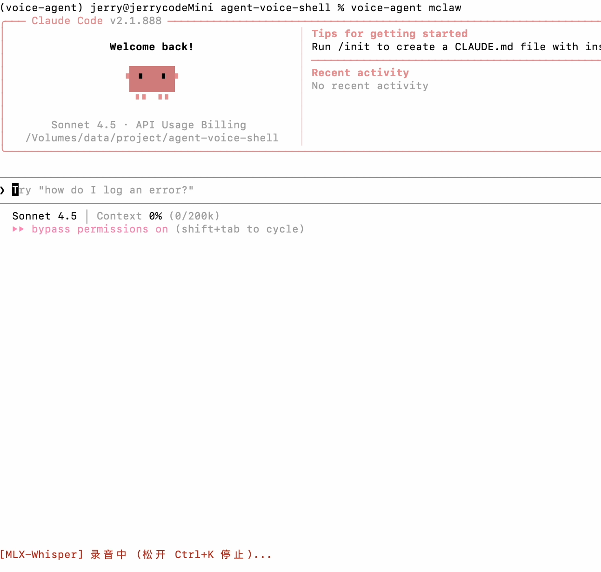

# Voice Terminal - 双向语音终端

为命令行 AI 助手（如 Devin/Claude CLI）添加语音交互能力的 PTY wrapper。



## 核心功能

- **语音输入（STT）**：按住 Ctrl+K 录音，松开后通过 Whisper 模型转录为文字，自动注入到终端输入并执行命令
- **语音输出（TTS）**：按 Ctrl+T 切换朗读模式，AI 回复的文字自动通过 Qwen3-TTS 合成语音播放

## 架构设计

- **语音终端（voice_agent.py）**：完整解决方案，结合了 PTY wrapper、基于 MLX Whisper 模型的语音转文字（STT）功能，并处理键盘快捷键。捕获键盘输入，处理语音命令，同时保持原生终端体验。

## 关键技术

- **按键检测**：利用键盘重复机制（repeat rate）判断 Ctrl+K 的按住/松开状态，超过 0.6s 无新字节即判定松开
- **PTY 透传**：pty.fork() 创建伪终端，完全透传 stdin/stdout，通过终端查询库避免乱码
- **TTS 缓冲**：缓存 PTY 输出，检测 2s 停顿后触发合成；后台异步播放不阻塞终端
- **服务端自动启动**：客户端首次调用时检测并自动拉起服务端进程

## 环境配置

### 1. 创建 Conda 环境

```bash
conda create -n voice-agent python=3.11 -y
conda activate voice-agent
```

### 2. 安装依赖

```bash
pip install -r requirements.txt
```

### 3. 依赖说明

- **MLX 框架**：Apple Silicon 加速（mlx, mlx-lm, mlx-whisper）
- **音频处理**：sounddevice, soundfile, numpy
- **模型下载**：modelscope（优先从 ModelScope 下载模型）
- **TTS 模型**：torch, transformers

## 使用方法

### 快速开始

1. 激活环境：
```bash
conda activate voice-agent
```

2. 运行客户端：
```bash
python voice_agent.py
```

程序会自动检测并启动需要的服务端进程。

### 快捷键说明

| 快捷键 | 功能 |
|--------|------|
| Ctrl+K | 按住录音，松开进行语音识别 |
| Ctrl+T | 切换 TTS 朗读模式（开启/关闭） |
| Ctrl+D / exit | 退出 Voice Terminal |

### 注意事项

程序是一个独立解决方案，内部处理所有语音处理功能。不需要单独的服务进程。

## 项目结构

```
agent-voice-shell/
├── README.md              # 项目说明文档
├── README-zh.md           # 中文项目说明文档
├── requirements.txt       # Python 依赖配置
└── voice_agent.py         # 主程序（集成语音功能的终端，含STT功能）
```

## 技术栈

- **Python**：主要开发语言
- **MLX**：Apple Silicon 加速框架
- **MLX Whisper**：适用于 Apple Silicon 的语音识别模型
- **ModelScope**：模型下载平台
- **sounddevice**：音频输入输出
- **PTY**：伪终端
- **NumPy**：音频处理的数值计算

## 注意事项

1. 本项目为 Apple Silicon 优化，利用 MLX 框架进行硬件加速推理
2. 首次运行会自动从 ModelScope 下载模型，需要网络连接
3. 确保系统有录音和播放权限
4. 应用程序在单个进程中处理语音输入和终端交互

## 许可证

MIT License